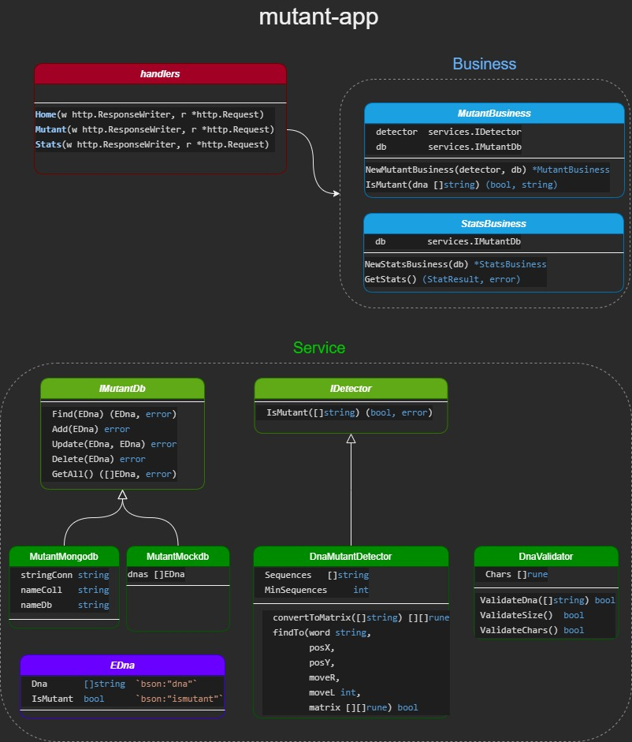
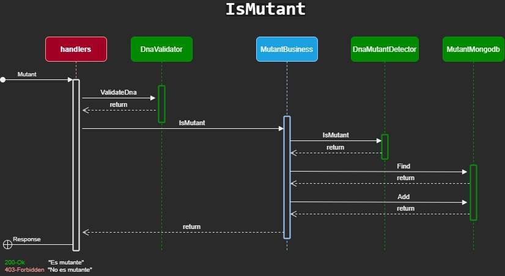

# mutant-app
Magneto quiere reclutar la mayor cantidad de mutantes para poder luchar contra los X-Men. Te ha contratado a ti para que desarrolles un proyecto que detecte si un humano es mutante basándose en su secuencia de ADN.

## Ejecutar la API
* Si no tenes Go -> Descargar e instalar Go: [here](https://www.golang.org)
* Verificar instalacion -> `go version`
* Descargar el repo -> en Zip o con `git clone`
* Abrir terminal desde carpeta donde esta descargado el repo
  * `go build`
  * `go run main.go`

Si todo anda bien deberia aparecer en la terminal:
`Listening...`

## API
La api se encuentra hosteada en Heroku:
https://arn-mutant-app.herokuapp.com/

### Metodos
* /Mutant  `POST`
```json
{
  "dna":["ATGCGA","CAGTGC","TTATTT","AGACGG","GCGTCA","TCACTG"]
}
```

* Responses
  * **200-OK** "Es mutante"

  * **403-Forbidden** "No es mutante"

> Si hubo un error de conexion a la db, la validacion se hace igual, pero en el msj de respuesta se agrega un msj aclarando que no pudo guardar en db

---

* /Stats `GET`
```json
{
  "Count_mutant_dna": 40,
  "Count_human_dna": 100,
  "Ratio": 0.4
}
```

> Si hubo error de conexion a la db. Devuelve:
> **503-ServiceUnavailable** "Hubo un error al obtener las estadisticas" 

### Configuraciones API
La api puede ser configurada seteando algunas variables de entorno:
* VALID_CHARS: son todos los caracteres validos para un ADN. Default: "A" "T" "C" "G"
* SEQUENCES: son todas las secuencias validas para determinar si es un mutante. Default: "AAAA" "TTTT" "CCCC" "GGGG"
* MIN_SEQUENCES: cantidad minima de secuencias para determinar si es un mutante. Default: 2

## El proyecto
* API hecha en GO y MongoDB
* Conformado por dos ramas (master, dev)
* Cada uno configurado con Integracion Continua en la pestania "Action"
* Enfoque TDD
* Delivery Continuo mendiante Heroku con dos instacias QA y PR
* Se dispone de un deploy extra por pull request para realizar testing cruzado

## Diagrama de clase



## Diagrama de secuencia


